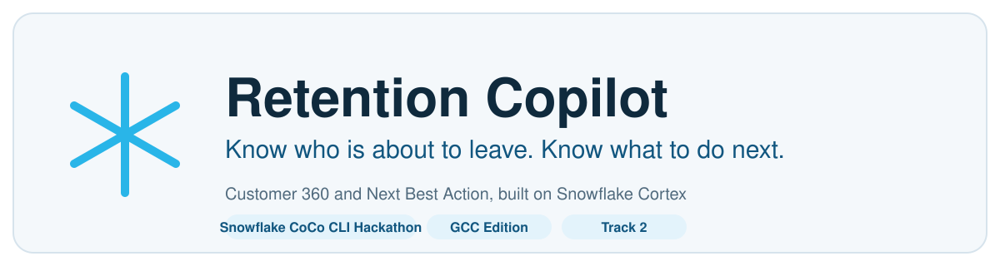
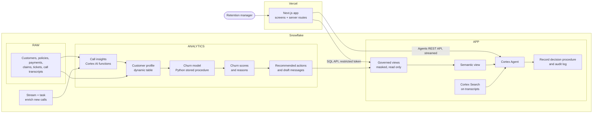

<p align="center">
  
</p>

# Retention Copilot

**Know who is about to leave. Know what to do next.**

Built for Track 2 of the Snowflake CoCo CLI Hackathon 2026, GCC Edition: Customer 360 and Next Best Action.

---

## The problem

A retention manager at an insurer looks after thousands of customers. The warning signs are scattered:

- payments that keep failing sit in one system
- an open claim sits in another
- an angry phone call is a recording nobody has time to replay
- a mention of a competitor never reaches anyone who can act

By the time a customer cancels, every sign was already on file. The manager has no single view of a customer, no ranking of who to call first, and no clear next step for each person.

## The solution

Retention Copilot gives the manager one screen per customer and one ranked list for the day.

- **Customer 360.** Policies, payments, claims, tickets and call transcripts joined into one profile.
- **Churn risk.** A modelled chance of cancelling within 90 days, with the plain-language reasons behind it.
- **Next best action.** One recommended step per customer, such as a claims follow-up call, with a reason, a confidence level and a draft message.
- **Human in charge.** The manager approves or dismisses each action. Every decision is written to an audit log.
- **Ask in plain English.** "Which high risk customers should we call first?" is answered from governed data, with the table shown.

The data is synthetic. Nothing here is real customer data, and the churn figures are modelled probabilities on that synthetic data.

---

## Architecture



Three rules shape the design:

1. **Everything smart happens inside Snowflake.** The app only draws screens and asks Snowflake for answers.
2. **The app can only read views.** Its token belongs to a service user with one small role. It has no access to the raw or analytics tables.
3. **Personal data is masked in Snowflake.** Last names, email addresses and phone numbers are masked by policy, so the app and the agent never see them.

---

## How we use Snowflake

| Component | What it does here |
|---|---|
| **Cortex AI functions** (`SENTIMENT`, `AI_CLASSIFY`, `AI_EXTRACT`, `COMPLETE`) | Turn 1,000 call transcripts into sentiment, main topic, competitor mentioned, complaint reason and cancel intent. |
| **Dynamic table** | `CUSTOMER_PROFILE` joins every source into one row per customer and refreshes on its own. |
| **Python stored procedure** (scikit-learn) | Trains and compares churn models inside Snowflake, checks for leakage, and writes scores and per-customer reasons. |
| **Views** | `CUSTOMER_OVERVIEW` and `CALL_OVERVIEW` are the only data the app reads. |
| **Semantic view** | Describes the churn data in business terms so Cortex Analyst can write correct SQL. |
| **Cortex Analyst** | Turns a manager's question into SQL against the semantic view. |
| **Cortex Search** | Finds what customers said across call transcripts. |
| **Cortex Agent** | Chooses between Analyst, Search and the decision tool, and streams the answer to the app. |
| **Stored procedure** | `RECORD_ACTION_DECISION` records an approval or dismissal. It is the only way the app writes anything. |
| **Stream and task** | A new call transcript is enriched automatically, with no manual run. |
| **Masking policies** | Hide last name, email and phone for every role except the administrator. |
| **Roles, service user and token** | A read-only role, a service user, and a programmatic access token restricted to that role. |
| **Resource monitor** | Caps spend at 100 credits and suspends the warehouse at the limit. |
| **Cortex AI Guardrails** | Script written in `snowflake/governance`. Enabled just before the demo. |

The churn model is honest about its limits. On synthetic data the chosen logistic regression scores a test AUC of 0.65 against 0.67 on training data, so it is not memorising. A model trained on shuffled labels scores 0.54, close to the 0.50 of a coin toss and within the noise of a test set with about 290 churners. Customers in the High tier churned at 39% in the test set against 15% in the Low tier, and the average predicted probability (20.7%) matches the actual churn rate (20.8%).

---

## How we use CoCo CLI

Every Snowflake step was authored and run through **Cortex Code (CoCo) CLI**:

- We wrote a short brief for the step and ran it with `cortex exec` against the event account.
- CoCo wrote the SQL files in `snowflake/`, ran them, and reported what it saw.
- We read each result independently and sent CoCo back with corrections. Examples: a reversed competitor rule, a wrong response path for the Cortex `COMPLETE` call, and churn probabilities inflated by class weighting.
- The prompt, the report and the full transcript of every step are saved in [docs/coco-evidence](docs/coco-evidence).

The steps CoCo ran, in order: setup, synthetic data, transcript enrichment, customer profile, churn model, next best action, semantic layer, agent, automation, governance.

### A reusable CoCo skill

[.cortex/skills/snowflake-step-builder](.cortex/skills/snowflake-step-builder/SKILL.md) turns the routine that kept those ten steps reliable into a skill any team can reuse. It covers reading one brief, numbered SQL files, describing tables before use, running in order, a check file that can fail, keeping personal data out of app-readable objects, and reporting only what was verified.

CoCo finds it automatically when run from this folder (`cortex skill list` shows it under PROJECT). To share it, use `cortex skill publish` to a stage.

The Next.js app was written by hand, outside CoCo.

---

## Tech stack

| Layer | Choice |
|---|---|
| Data and AI | Snowflake, Cortex AI functions, Cortex Analyst, Cortex Search, Cortex Agents |
| Modelling | Python and scikit-learn inside a Snowflake stored procedure |
| Snowflake authoring | CoCo CLI |
| App | Next.js 15 (App Router), React 19, TypeScript in strict mode |
| Styling | CSS Modules on shared design tokens, Source Sans 3, light theme only |
| Access | Snowflake SQL API and Agents REST API, called from server routes only |
| Hosting | Vercel |

The code follows a few plain rules: one thing per file, no comments, plain names, and no colour written outside `src/styles/theme.css`.

---

## Set up the application

You need Node.js 20 or newer and a Snowflake account with the steps below already run.

```bash
git clone <this repository>
cd retention-copilot
npm install
cp .env.example .env.local
```

Fill in `.env.local`:

| Variable | Value |
|---|---|
| `SNOWFLAKE_ACCOUNT_URL` | `https://<account identifier>.snowflakecomputing.com` |
| `SNOWFLAKE_TOKEN` | The restricted token created in `snowflake/governance/01_create_app_service_user.sql` |
| `SNOWFLAKE_WAREHOUSE` | `RETENTION_COPILOT_WH` |
| `SNOWFLAKE_DATABASE` | `RETENTION_COPILOT` |
| `SNOWFLAKE_SCHEMA` | `APP` |
| `SNOWFLAKE_ROLE` | `RETENTION_COPILOT_READER` |
| `SNOWFLAKE_AGENT` | `RETENTION_AGENT` |

Then run it:

```bash
npm run dev
```

Open http://localhost:3000.

Other commands:

```bash
npm run typecheck
npm run build
npm run start
```

`.env.local` is ignored by git. Never commit a token. To deploy, add the same seven variables in the Vercel project settings.

---

## Set up Snowflake

Run the files in each folder of [snowflake](snowflake) in number order, as an administrator role, one folder after another. Each folder ends with a `check` file that shows the step worked.

| Order | Folder | What it builds |
|---|---|---|
| 1 | `setup` | Database, schemas, resource monitor, warehouse, roles and grants |
| 2 | `synthetic-data` | The synthetic insurer: customers, policies, payments, claims, tickets, call transcripts |
| 3 | `transcript-enrichment` | Cortex AI insights for every call |
| 4 | `customer-profile` | The customer 360 dynamic table and churn labels |
| 5 | `churn-model` | Train, score and explain the churn model |
| 6 | `next-best-action` | Recommended actions and draft messages |
| 7 | `semantic-layer` | App views, semantic view, Cortex Search service, reader grants |
| 8 | `agent` | Decision log, decision procedure, the agent, agent grants |
| 9 | `automation` | Stream and task that enrich new calls |
| 10 | `governance` | Service user and token, masking policies, activity views |

Notes:

- Cortex AI functions and Cortex Agents must be available in your account region. Cross-region inference may need to be enabled.
- Steps 3 and 5 use the most credits. Keep the warehouse at X-Small. The resource monitor stops spend at 100 credits.
- `governance/01_create_app_service_user.sql` creates the token for the app. Copy it when it is shown, because Snowflake will not show it again.
- `governance/05_write_guardrails_script.sql` is a script to run once, close to the demo. It is not part of the numbered run.
- Run `governance/00_create_token_authentication_policy.sql` before `governance/01_create_app_service_user.sql`. It creates an authentication policy that does not enforce a network policy for programmatic access tokens. Without it Snowflake refuses the token with "Network policy is required".

---

## Back up and restore the raw data

The synthetic data is random, so generating it again gives different customers. Run [snowflake/backup](snowflake/backup) right after step 2 to keep the exact set.

- `01` and `02` copy the six raw tables to Parquet files on a Snowflake stage. Download them with `snow stage copy @RETENTION_COPILOT.PUBLIC.BACKUP_STAGE <local folder> --recursive`.
- `03` clones the RAW schema into `RETENTION_COPILOT_BACKUP` for a quick in-account copy.
- `04` restores the tables from the stage. Upload the files back with `snow stage copy <local folder> @RETENTION_COPILOT.PUBLIC.BACKUP_STAGE --recursive`, create empty tables with the `synthetic-data` table files, then run `04`. It appends rows, so run it only on empty tables.

---

## Repository map

```
snowflake/      SQL for every step, written and run through CoCo CLI
docs/           app brief, synthetic data brief, CoCo evidence, banner
src/app/        pages and API routes
src/components/ screens and pieces of screens
src/hooks/      data loading and the ask stream
src/lib/        Snowflake calls, validation, formatting
src/styles/     theme tokens
PLAN.md         the plan and scoring notes
SNOWFLAKE.md    the Snowflake ideas used, in plain words
```
